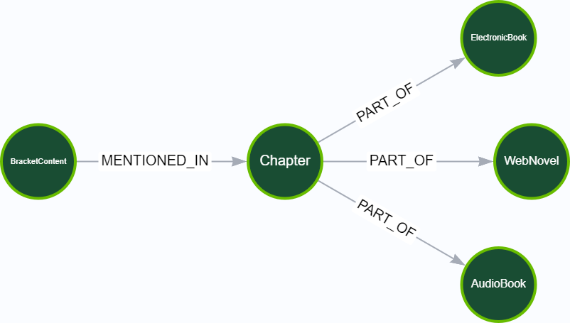
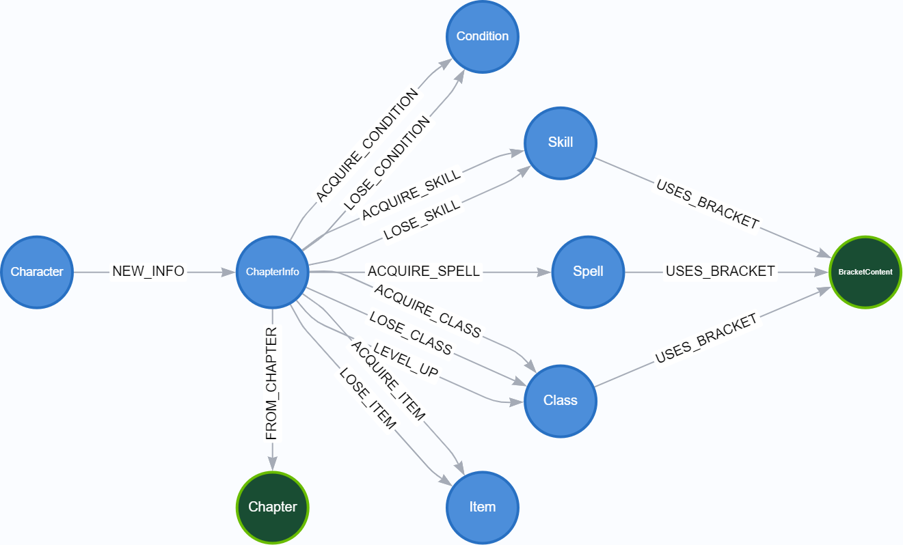

# Seed Data

[](https://deno.land/)
[](./LICENSE.md)
[](https://gitpod.io/#https://github.com/wandering-inndex/seed-data)


> **IMPORTANT NOTICE**: Copyright for almost all the text in this repository goes to the author, **pirateaba**. Please support them through their official channels:
>
> - https://wanderinginn.com
> - https://store.wanderinginn.com
> - https://patreon.com/pirateaba

This repository contains the seed data used to power the index. Contributions are very much welcome! Just remember to **only include the data for public chapters**, and most importantly, "**No Killing Goblins!**".

## Requirements

- [Deno](https://deno.land/)
- [SurrealDB](https://surrealdb.com/)
- [Neo4j](https://neo4j.com/)

## Schema

Currently, we are only extracting the `Chapter`, Media (`WebNovel`, `ElectronicBook`, `AudioBook`), and `BracketContent` nodes.



But in the future, we are planning to include other named entities such as `Character`, `Class`, Abilities (`Skill`, `Spell`), and other data.



A `ChapterInfo` will be connected to a `Character` and `Chapter`, and that will allow us to view a character's information from the beginning of the story to a specific chapter:

```
// Sample query to get all the available information of
// a Character named "Erin Solstice" before WebVolume 2.
// (WebVolume 1 comprises of Chapters #1 to #65).

MATCH
  (c:Character)-[:NEW_INFO]->(ci:ChapterInfo)-[:FROM_CHAPTER]->(ch:Chapter)
WHERE
  c.name = "Erin Solstice"
  AND ch.webNovelOrder < 66
  AND ch.metaShow = true
RETURN info
```

This way, one can choose their level of spoilers.

## Development

Please see bundled [DEVELOPMENT file](./DEVELOPMENT.md) for more details.

## Contributing

**Imposter syndrome disclaimer**: We want your help. No, really.

There may be a little voice inside your head that is telling you that you're not ready to be an open source contributor; that your skills aren't nearly good enough to contribute. What could you possibly offer a project like this one?

We assure you - the little voice in your head is wrong. If you can write code at all, you can contribute code to open source. Contributing to open source projects is a fantastic way to advance one's coding skills. Writing perfect code isn't the measure of a good developer (that would disqualify all of us!); it's trying to create something, making mistakes, and learning from those mistakes. That's how we all improve, and we are happy to help others learn.

Being an open source contributor doesn't just mean writing code, either. You can help out by writing documentation, tests, or even giving feedback about the project (and yes - that includes giving feedback about the contribution process). Some of these contributions may be the most valuable to the project as a whole, because you're coming to the project with fresh eyes, so you can see the errors and assumptions that seasoned contributors have glossed over.

Please see bundled [CONTRIBUTING file](./CONTRIBUTING.md) for more details.

## License

Licensed under **MIT**. Please see bundled [LICENSE file](./LICENSE.md) for more details.
